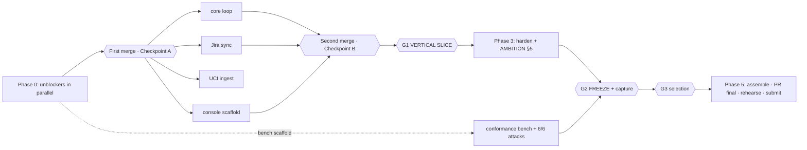

# Precedent — BUILD PLAN (Friday 3 July → Saturday 4 July, DoraHacks close 23:59 BST)

> Revised Friday 3 July. **This revision assumes all five teammates have repo access and capable AI coding tools (Claude Code / Codex-class), not free-tier claude.ai.** That changes the shape of the plan: no relay of "packets" through one person, no seat-budget rationing, no minute-by-minute grid. Instead — a small number of **load-bearing gates in a locked order**, dependency-ordered work, and per-person **missions** that give each teammate enough context to drive their own AI tools hard. Because capacity is no longer the binding constraint, this plan is **deliberately more ambitious** — but ambition is pushed *within* the idea's locked direction (§5), not by relitigating its settled cuts: the demo that wins Conduct is protected as the floor, and a stretch layer (chiefly the complete BasedAI green-tick table, plus a self-running console and an auditor-grade change-record artifact) is layered on top.
> Companion files: detailed task briefs in [`Plan/workflows/`](workflows/) (now direct-commit references, not free-tier packets) · prep drafts in [`Prep/`](../Prep/) · build-dependent prep spec in [`Plan/prep-spec.md`](prep-spec.md) · the repo is already scaffolded (see §0.1) with the project skill at [`.claude/skills/precedent/SKILL.md`](../.claude/skills/precedent/SKILL.md) — **read that skill first; it carries the four hard rules that are eligibility-fatal to break.**

---

## 0. Assumptions (correct these here if wrong; the plan reads from this box)

| Assumption | Value |
|---|---|
| Team | 5 people, **all with repo access + capable AI coding tools + decent models.** Two lead builders (**T1, T2**), one who flexes between focused build tasks and verification (**T3**), and two who own the content/story/submission surface and can now commit directly and drive AI tools themselves (**N1, N2**) |
| The real constraint | **Not person-hours — integration sequencing and the code-freeze.** Five people all driving good models can generate a lot of code fast; what can't be rushed is merging it coherently, hitting the vertical slice, and capturing the demo against a frozen build. Plan against *dependencies and gates*, not a clock |
| Time envelope | Friday: a full working day for the builders, most of the day for N1/N2. Saturday: a few hours before Demo Day, then Demo Day itself (Blackett LT1, 10:00–16:30) which is **not build time**. Treat these as generous but finite — the freeze has to leave Saturday morning for assembly and rehearsal |
| Models | All seats have capable models. **No free-tier sizing, no packet relay, no usage-cap ritual.** If one seat's model rate-limits, the person switches to their alternate (Codex/another provider) — every task in this plan is specified well enough that any capable model can run it. Bias only: T1 spent budget on the overnight planning, so let T2 take the single longest agentic session (the memory package) — a courtesy, not a hard constraint |
| AI-tool discipline | Everyone works in a **git worktree or branch** so parallel work never collides; merge at the phase boundaries (below). Point your AI tool at the **spec section named in your task** and the project skill; make it **run the verification** (`make test`, `make check-open-weight`) before you call something done. The specs are the source of truth — the AI tool implements *to* them, it doesn't get to redesign them |
| Generated visuals | Higgsfield MCP connected (free plan, ~8 credits — a few stills only). Venice `/image/generate` works (`venice-sd35`, tested). Both optional; the video is real screen-recording first |
| GitHub | Repo publication + the BasedAI PR are still done by a human with a GitHub account (no token wired), but **anyone can own it now** — assigned to T3 by default. Secrets state **verified clean** this session (`.env` never committed, gitleaks clean across all history) |

**Already DONE — do not re-plan (committed, with evidence):** Venice open-weight verification (all four pinned IDs vs public HF weights, `/models` dumps in `docs/compliance/`). Jira **Standard** verified incl. issue-security enforcement ≤5 s and the auditing API (06 §1). UCI corpus measured incl. arrival-time precision 59.4%/87.7% (`data/analysis/`). ASI:One + Agentverse keys live. **Repo scaffolded + tooling installed** (§0.1). All five refinement specs, prep drafts, and task briefs written.

### 0.1 Starting state — you are not beginning from a blank repo

Committed this week and ready to build on:
- **`precedent/models.py`** — the open-weight registry + startup guard, tested (passes on the live catalog, rejects closed models). Import roles, never literal ids.
- **`precedent/contracts.py`** — the frozen pydantic message boundary (real).
- **`precedent_memory/schema.sql`** — the full memory schema, executes cleanly.
- **`precedent_memory/tests/`** — 9 spec-encoding tests (conjunction incl. the incident-3 case, fail-closed, concurrency) that **skip until implemented** — implement to green.
- **Scaffold**: `pyproject.toml` (uv), `Makefile`, `.env.example` (Venice-only), stub modules for every package (`extractor`/`policy`/`ladder`/`venice`/`orchestrator`, memory `store`/`retrieve`/`sync`/`audit`/`bench`, `sim`/`console`/`agents`) — each stub names its **spec section, owner, and the rule that bites there**, then `raise NotImplementedError`. `tests/test_scaffold_smoke.py` (4 passing wiring tests) proves it's all connected.
- **Setup**: `uv pip install -e ".[dev,agents]"`, `cp .env.example .env`, `make test`. `uagents` verified on Python 3.13 — no separate agents runtime needed.

---

## 1. Gates — the load-bearing checkpoints (order is locked; times are targets, not minute-pins)

Everything else flexes; these do not. Treat them as the spine.

| Gate | Target | The rule |
|---|---|---|
| **G0 — Kickoff** | Friday start | 15-minute stand-up: confirm the Demo Day form is in (was due 18:00 today — if not, submit at once: forms.gle/fnUe3vL24wyJo6pD7). Agree the branch/worktree split. Declare the **canonical mutation seed** (one seed → one number → four surfaces). Open the BasedAI **skeleton PR** and register the **hello-world Watcher** to start the Agentverse discoverability clock early. Pick the **ambition targets** for the day from §5 |
| **Checkpoint A — Integration** | Early afternoon | Is the memory package + core loop merged and talking? If **no**, fire the cheapest cut-lines now (C-flow demo, temporal extras) and collapse the third Fetch agent in-process — don't let a slow start silently threaten the slice |
| **Checkpoint B — Slice forming** | Mid-afternoon | Is the loop running end-to-end headless? If **no**, incident 3 becomes video-only and the console audit view stays a JSON tail. The live stretch items (§5) wait |
| **G1 — VERTICAL SLICE (the one that matters)** | Friday, leave a solid evening margin | Incidents 1+2+recovery run **end-to-end on seeded real data**, with the **Baseline Bar + Approve/Promote/Revoke** clickable. This is the floor of a winning Conduct demo. Once it's green, the ambition layer is safe to pursue; until it's green, everything bends toward it. Immediately after: a first full two-presenter run-through + the 100-mutation extractor bench run (its number feeds the on-screen chip, slide 10, README, BUIDL) |
| **G2 — CODE FREEZE + CAPTURE** | Friday evening | Freeze the demo build. Then the real screen-capture session (labelled raw clips), the ASI:One shared-chat final capture, the hosted-Watcher deploy, and the BasedAI PR bench-numbers commit. Anything not frozen by now ships as it is |
| **G3 — Selection branch** | ~22:00 Friday (announcement) | Someone watches the Demo-Day-presenter announcement and calls the branch (§7). Both branch checklists prepared before the freeze |
| **G4 — BasedAI PR final** | Before Saturday judging | Video link pushed, the full metric table + attack results committed, headings verbatim, no secrets |
| **G5 — Rehearsal go/no-go** | Saturday morning | Run the §4.3 rehearsal gates; two failures flips the demo to narrated-recording + one live Approve click. No debate — the rule is agreed at G0 |
| **G6 — DoraHacks final submit** | Saturday, comfortably before the deadline | Draft BUIDL goes in early (entries stay editable; **organizer-question answers are one-shot** — write them Friday). Final submit after a logged-out link sweep. Platform hard close 22:59 UTC — finish hours early |

### 1.1 Human action items the documents can't do (from the idea §6 — carry ALL of these; ratify at G0)

These are not build tasks; they are decisions and human acts only the team can make. Losing one loses the entry it belongs to.

1. **Demo Day form submitted before 18:00 today** — screenshot the confirmation into the repo. (Was due today; if it slipped, this is the first thing at G0.)
2. **Invite the 2nd Jira agent seat** (~15 min, covered by the Standard trial), record its accountId in `.env`, add it to role 10007 — so incident 3's deny/allow split is two named humans, not one account switching hats. (Single-account role-flip is the fallback.)
3. **Name the BasedAI PR owner and open the skeleton PR at G0** (T3 by default) — template-verbatim, models declaration, six attack names, `docs/compliance/` cites; ask a mentor which deadline governs, note it in the PR.
4. **The team slide / founder layer** — three one-line credentials + an honest post-Saturday-intent sentence; the ~2h practitioner outreach (N2) that turns the VC judge's "any real buyer signal?" into a quote, **or the validation line is deleted** — never faked. Rehearse the 15-second "why us / why now / why full-time" as the first Q&A answer.
5. **Ratify in writing at G0:** the demo-mode gate rule (04 §4.3), the two mechanical checkpoints, the ~22:00 selection-announcement branch (selected → attract-mode + RESTRICT hotkey; not selected → 90s cut + video inserts), the ambition targets from §5, and a **named-person mapping** onto the T1–N2 profiles (the specs assign workstreams, not people).
6. **Courtesy-confirm with the Fetch dev advocate (Gautam, Discord)** that DoraHacks is the only submission channel (Devpost was adversarially refuted — hackpack boilerplate; one message closes it).

## 2. The flow, in phases (dependency-ordered, not clock-ordered)

**Phase 0 — Kickoff & unblockers (everyone, first thing).** G0 stand-up. Then the things that unblock others start immediately and in parallel: the model/Venice wiring + hello Watcher (T1), the memory package (T2), the sim + seed data + KB corpus + loaders (T1 — now self-sufficient, see §4 T1), the skeleton PR + agent pre-registration + the conformance-bench scaffold (T3), the deck + content-integrity/provenance review (N1), the video plan + submission scaffolding (N2). None of these block each other.

**Phase 1 — Foundations converge → first merge.** The memory package and the sim/loop foundations meet at the **first merge**; freeze the contract boundary there (it's already scaffolded in `precedent/contracts.py`). Checkpoint A rides on this merge. After it: the core loop, the Jira sync, and the UCI ingest run in parallel off the merged base.

**Phase 2 — Integration → the vertical slice (G1).** The loop's fast-path plus the console's Baseline-Bar-and-buttons are the slice. The console starts on merge-independent scaffolding (static bar + button shells) and wires to real events after the second merge (Checkpoint B). Everything bends toward G1.

**Phase 3 — Hardening + ambition (once G1 is green).** This is where the higher capacity pays off. Baseline hardening (recovery beat solid, messy-input handling, fail-closed drill) runs alongside the **stretch layer** from §5, in its tiers: the full BasedAI metric table + 6/6 attacks + derived-memory correctness + O(1) curve and the live bench (the idea-adopted ambition); temporal-embargo as a bench test + Q&A claim (not a stage beat); the hosted Watcher; the attract-mode idle loop + live RESTRICT hotkey **if selected to present**; the change-record artifact once the aligned stretch is green. The Fetch rails go fully live here (behind the addresses registered in Phase 0). Payment Protocol stays a narrative line, not a build (§5).

**Phase 4 — Freeze & capture (G2).** Freeze, capture the demo against the frozen build, record the ASI:One session, deploy the hosted Watcher, commit the PR numbers, draft the one-shot BUIDL answers, run the table-read. Then the selection branch (G3).

**Phase 5 — Saturday: assemble, finalise, rehearse, submit.** Video assembly, the BasedAI PR final (G4), the DoraHacks draft + final (G6), the rehearsal gates (G5), crib sheets, and the demo run-of-show — then Demo Day.

## 3. Critical path & what protects the demo

The shortest path to a submittable, winning entry runs: **unblockers → first merge → core loop + Jira sync → console Bar+buttons → vertical slice (G1) → freeze + capture (G2) → Saturday assembly + PR final + rehearsal → submit.** The demo is protected three ways: (1) the vertical slice is the immovable floor and everything bends toward it before any ambition is pursued; (2) the freeze leaves Saturday morning entirely for assembly and rehearsal, so a rough Friday still yields a clean submission; (3) the ambition layer (§5) is strictly *additive* — every stretch item can be dropped without touching incidents 1+2, the Fetch hard gates, or BasedAI eligibility. **When ambition and the clock collide, the demo and the Conduct rubric win** — that ordering is not negotiable, and it's why §5 is a ladder, not a checklist.

## 4. Per-person missions

Each mission gives you: **what you own and why**, your work **in dependency order** (not clock times), the **context you need** (spec files, `.env`, verified facts), and **how to drive your AI tool** on the hard parts. Read the project skill (`.claude/skills/precedent/SKILL.md`) before you start — it carries the four hard rules. Work on a branch/worktree; merge at the phase boundaries.

### T1 — Core loop, sim, and the Fetch rails (the demo's engine)

**You own** the thing the demo actually runs: the sim that produces incidents, the deterministic loop that resolves them, and the Fetch agents that make it discoverable — plus, now, the **seed data and KB corpus** the sim serves (T1 is self-sufficient so the demo never waits on the content lane; N1 reviews it for content integrity, §4 N1). If your parts work, there's a demo.

**In order:**
1. **Wire the model backend + register the hello Watcher.** `precedent/venice.py` (chat + embeddings over the Venice API, roles from `precedent/models.py`, startup guard against the live `/models`); a minimal Chat-Protocol echo Watcher on Agentverse to start the discoverability clock. *Context:* 02 §1.3; `models.py` is done. *Drive your tool:* "implement `venice.py` per 02 §1.3 using the existing `precedent.models` roles; add the `/models` startup guard; then a uagents mailbox echo agent with the Chat Protocol import verified in `agents/__init__.py`." Verify: one real ASI:One round-trip; `make check-open-weight` clean.
2. **The seed data + KB corpus + sim + loaders + fixtures.** First **fetch and commit the real public data** (TVmaze GB 7-day + Freeview XMLTV + UCI CSV are auth-free; the two Kaggle CSVs are optional with a documented fallback) and **author the ~10-article KB corpus** (critical five first: EPG-publish #1, the two restricted rights runbooks #4/#5, CrowdStrike CF-291 #6, one stale — 11-field front-matter, real `adapted_from` links, ACL/stale flags). T1 is **self-sufficient** so the sim + retrieval demo run offline without waiting on anyone; **N1 reviews the result for content integrity** (§4 N1). Then one FastAPI app, four routers, one SQLite, seeded from that committed data; fixed-seed incident fixtures (1/2/3 replay identically); the `flake?once=true` recovery hook; the two restricted runbook issues seeded with the issue-security level. *Context:* 01 §1–4/§6 (**keep the real data's nulls/dupes — they're demo fodder**), `.env` level IDs. *Drive your tool:* draft the KB articles from 01 §4's table, pull the raw data per `data/raw/SOURCES.md`, write one loader per router as subtasks, then verify loader counts against the raw files and that fixtures replay identically.
3. **The core loop** (after the first merge): extractor + fingerprint, YAML policy engine, ladder, and the **zero-LLM standing-approval fast-path** + the snapshot/rollback/demotion recovery beat. The generator's mutation layer consumes the canonical seed. *Context:* 02 §3.1–3.3; the frozen contracts are in `precedent/contracts.py`; `fingerprint()` is already written in `extractor.py`. *Drive your tool:* "implement the extractor/policy/ladder/orchestrator stubs to make the loop resolve incident 1 headless, then incident 2 on the fast-path with zero LLM calls in the trace, then incident R with auto-rollback + demotion." Verify: the trace shows no LLM call on the fast-path; failed extraction caps at L0/L1.
4. **The Fetch rails full** (Phase 3): real Watcher/Librarian/Operator handlers behind the pre-registered addresses, the approval-via-ASI:One gate (sender = principal, 10-min TTL), the **hop-trail footer** in replies, and the **hosted degraded-L0 Watcher** for the post-hackathon bonus. *Context:* 02 §3.4, 05 §E. Verify: a fresh ASI:One session runs the whole loop incl. the standing-approval repeat; capture the shared-chat URL.

### T2 — The memory package, Jira sync, and the console (governance + the face of the demo)

**You own** the BasedAI story (a real permission-aware memory library) and the surface the judges watch (the console). Both are yours because both need judgment when the AI tool gets subtle things wrong (fail-closed edges, SSE timing).

**In order:**
1. **`precedent_memory`** — start from `schema.sql` + the three red test files and **implement to green**: store (lineage + bitmap compile), retrieve (`permitted()`+`stale()` fail-closed, **zero LLM imports**, TOCTOU in one transaction), hash-chained audit, the A/B/C semantics, C-flow stub. *Context:* 02 §2. *Drive your tool:* "make `precedent_memory/tests/` pass — implement store/retrieve/audit to satisfy `test_conjunction` (the multi-source incident-3 case), `test_fail_closed`, `test_concurrency`; retrieve.py must not import any model." Verify: `make test` green; grep retrieve.py for LLM imports (none).
2. **Jira sync** (after the first merge): 2–3 s poll of roles + live-scheme grants + the **issue-security field on runbook issues**, versioned digest upserts, revocation fan-out, write-behind + cache replay, the fail-closed lock + degraded banner. *Context:* 02 §2.5/§4.1, 06 §1.2b (IDs in `.env`). *Drive your tool:* implement `sync.py` and a write-behind Jira client; then **verify against the real site** — flip role 10007 and confirm deny ≤8 s with an `acl_sync_applied` event, and a network-kill drill (restricted denied, public served, writes replay). This is the dual-enforcement demo mechanic — make it real.
3. **The console** (Phase 2): server-rendered page + SSE, no framework. **Build order matters: Baseline Bar (CSS-width animation) + Approve/Promote/Revoke buttons FIRST** — the vertical slice needs exactly these. Then feed, streamed trace, audit JSON tail, degraded banner, provenance footer, the robustness chip slot, the cumulative close strip. *Context:* 02 §4, 04 §1.2. Label L3 "Standing Approval" everywhere. *Drive your tool:* start it on the static scaffold before the merge, wire to real SSE events after. Verify at G1: incidents 1+2 drive by click with the Bar drawing elapsed bars.
4. **Ambition (Phase 3, only after G1 — per §5's tiers):** the live RESTRICT hotkey + attract-mode idle loop **if selected to present** (else the RESTRICT flip becomes a video insert); the rollback proof panel; and the change-record artifact only once the aligned stretch is green. Temporal-embargo is a bench test + Q&A claim, **not** a console beat.

### T3 — Benches, verification, submissions plumbing (the credibility layer + the safety net)

**You own** the numbers that beat the purpose-built BasedAI competitor, the checks that keep everyone honest, and the mechanics of actually submitting. Your work is decoupled from the product build, so you're also the flex reviewer.

**In order:**
1. **Open the BasedAI skeleton PR** (Phase 0, human GitHub task): fork, copy `_TEMPLATE`, README with the models declaration + `docs/compliance` cites + all six attack names + a placeholder video link, our Venice-only `.env.example`, no secrets. Ask a mentor which deadline governs; note it in the PR. *Reference:* `Plan/workflows/T3-github-publication.md`.
2. **Pre-register the Librarian + Operator agents** (echo skeletons, both badges) so T1 only swaps handlers later; run test chats toward the ≥10-interaction discoverability bar; capture an **insurance ASI:One shared-chat URL** early.
3. **The conformance bench + independent oracle + full adversarial suite** (decoupled — zero product-code imports; own worktree): the sponsor's exact topology (5 levels / 20 roles / 1,000 docs) + 10,000 ground-truth queries (≥3,000 deny-expected), an **independent naive-conjunction oracle** producing the ground-truth labels (so FNR isn't self-graded), and **all six** named attacks (not degraded to four — go for the complete table). *Context:* 02 §2.7. *Drive your tool:* "implement `conformance_bench.py` to emit RESULTS.md as a measured-vs-threshold-vs-pass/fail table for FNR/FPR/P50/P99/overhead/derived-memory-correctness/ACL-drift/TTC/audit-coverage; the oracle is a separate module with no import from store/retrieve." Run it against merged main before the freeze; commit the numbers into the PR.
4. **The extractor mutation corpus** (canonical seed) handed to T1 for the bench run; the **secrets scrub → repo public** (gitleaks is installed and the history is already clean — re-confirm and flip public); the **live-bench command** and **live drift/TTC vs real Jira** (§5). Saturday: the UCI realism run ("25k-record store", never "P99 over 141k events"), the PR final (G4), the DoraHacks draft+final (G6).

### N1 — Content integrity, provenance, and the deck (you have repo access now — commit directly)

**You own** the *honesty* of the demo and the *pitch that carries it*. T1 now fetches the public data and drafts the KB corpus so the engine is self-sufficient (§4 T1) — your job is the content layer on top: **verify** that data and those runbooks are honest and correctly flagged (the "two sets of eyes" the Conduct rubric rewards, and the same segregation-of-duties the product itself sells), own the licence/provenance story end to end, and build the deck. With the data pull and KB drafting off your plate, that freed capacity goes into the deck and the demo narrative. Where a task touches code, drive your AI tool and ask T1 for a quick review.

**In order:**
1. **Content-integrity review of the KB + seed data (T1 authors, you verify — get on this early).** As T1 commits the critical-five KB articles (EPG-publish, the two restricted rights runbooks, CrowdStrike CF-291, one stale) and the raw pulls, check every article for a real `adapted_from` source link, the correct `acl` (`rights-ops-only` on #4/#5) and `stale` flags, and the escalate-class case; confirm the raw data kept its messiness (nulls, duplicate titles) and wasn't sanitised. You are the **honest-data gate** — a wrong flag breaks the "it refuses" moment. *Reference:* `Plan/workflows/N1-kb-articles.md` (now the content spec T1 implements to; you own its correctness).
2. **The provenance + licence layer** — the README data-provenance table, attribution, and the TMDB/IMDb-rejected sentence are yours to write and defend (real-data diligence is itself a point-scorer). *Reference:* `Plan/workflows/N1-licence-attribution.md`.
3. **The deck** from `03-pitch-deck.md` (the spec IS the deck) — build it in Google Slides or, ambitiously, as a small HTML/Reveal deck in the repo if you'd rather version it; the numbers arrive from T3's bench and the extractor run, and the PDF export gets the self-narrating caption layer. *Reference:* `Plan/workflows/N1-deck-build.md`. **Never ship a `‹XX›` placeholder** — fill from the real numbers or delete the cell.
4. **The manual-loop time-lapse** (perform the manual fix against the sim once, 8× speed, burn the "8h51m" caption) and the video VO script (N2 assembles the video).
5. **Saturday:** the crib sheets ×5 and the rehearsal-gate checklist; pair with N2 on the naive-user playtest.

### N2 — Video, submissions, outreach, and QA (you have repo access now — own the whole submission surface)

**You own** how the work is *presented and submitted*: the video, the DoraHacks BUIDL, the Fetch deliverables, the practitioner signal the VC judge wants, and the QA that catches a wrong number before it ships. Commit directly; drive your AI tool for the fiddly bits.

**In order:**
1. **Practitioner outreach** (the one thing only a human closes): 10 warm-first sends, the change-board question, consent line — replies feed slide 12/A9 **or the line gets deleted**. *Reference:* `Plan/workflows/N2-practitioner-outreach.md`. Start this early; it needs time to land.
2. **The submission scaffolding**: the shared video folder + naming convention; the **BUIDL page as a 60-second skim artifact** + the **one-shot organizer answers drafted verbatim** (a builder freezes the text before submit); the Fetch deliverables checklist (badges, profile URLs, shared-chat URL). *References:* `N2-dorahacks-admin.md`, `N2-basedai-pr-readme.md` (draft the PR README from the architecture doc; T3 commits it).
3. **The naive-user playtest**: file awful tickets from a phone against the real console, grade TRIAGED/DEGRADED/CONFUSED — this hardens the party trick and finds real bugs. *Reference:* `N1N2-demo-playtest.md`.
4. **The video** (Saturday, from the frozen-build capture): assemble in CapCut/Descript from T2's labelled raw clips + N1's VO, per 04 §7's shot list and captions (**caption discipline: "25k-record store", the calendar-hours label, no unlabelled vendor claim**); the 30-second teaser; the not-selected 90-second cut. *Reference:* `N2-video-edit.md`. The video spine is **real screen recordings — never faked.**
5. **QA pass**: every on-screen and in-caption number against `Research/00-verified-claims.md` and `data/analysis/`; the pre-export `‹`-grep; the logged-out link sweep before final submit.

## 5. The ambition ladder (protected floor → stretch → reach)

Pick targets at G0 and revisit after G1. **The floor is sacred; the stretch is additive; the reach is only if you're flying.** Ambition is pushed *within* the idea's locked direction — the decision record in `Idea/Idea-Development.md` §7 is respected, not relitigated. The stretch raises the ceiling on the track the idea already prioritises (BasedAI's measured table) and on the honest bonuses; it does **not** re-open cuts the idea deliberately made (the temporal-embargo demo beat, the on-chain Payment Protocol) — those reasons still hold.

**FLOOR — the winning Conduct demo (never cut):** incidents 1+2+recovery+3, the Baseline Bar, human Promote/Revoke, the measured numbers (94.4% / 18.2 h / 59.4–87.7% arrival-time / extractor rates), the messy-input handling, the Fetch hard gates (Agentverse + Chat Protocol + ASI:One + no-frontend + public repo), BasedAI eligibility (open-weight + the five requirements + the PR), the deck + the real-screen-recording video. **Conduct (£8,000) is the primary track; this floor comes before any stretch item.**

**STRETCH — idea-adopted ambition, in-scope because capacity isn't the constraint (pursue in Phase 3, in priority order):**
1. **The complete BasedAI green-tick table** — all 10 published metrics measured vs threshold with the **independent oracle**, and **6/6** named adversarial attacks (not the 4/6 fallback) + derived-memory-correctness >99% + the O(1)/O(log-n) latency-vs-size curve. *This is the idea's headline BasedAI play (idea §2): hand the sponsor their own rubric, filled in green, against a live Jira ACL source the purpose-built BioVault can't match.* (T3)
2. **The live bench command + live drift/TTC** against real Jira role flips, timestamps anchored to Jira's own audit API — a benchmark that runs *in front of the judge* (idea §2, §3). (T3)
3. **Temporal-embargo — as a bench test + Q&A/README claim, NOT a demo beat.** An `unlock_at` predicate in the deterministic check, covered by a test, cited in the README + Q&A as a captured published bonus challenge. *The idea (§7) deliberately demoted this to bench-test-only: a fifth on-stage policy concept dilutes the two takeaway lines. Keep it off the stage.* (T2/T3)
4. **Hosted degraded-L0 Watcher** live post-hackathon (Fetch bonus, honest — idea §3). (T1)

**SELECTION-BRANCH items (build these only if selected to present; if not selected, the RESTRICT flip becomes a video insert instead — idea §6/§7 branch):**
5. **Attract-mode idle loop + live RESTRICT hotkey** — the console resolves seeded background incidents from doors-open ("it's been running while you watched the last three teams"), and a keypress does the live Jira ACL flip → dual-enforcement deny → restore. The strongest "not a scripted demo" signals available — but only if there's a stage. (T2)

**BEYOND THE ADOPTED SET (a Builder-round ceiling-raiser, not in the idea's decision record — pursue only after the aligned stretch above is green):**
6. **The change-record artifact** — one hotkey renders the audit trail as an ITIL-style change document (approver, timestamps, steps, rollback, hashes): "this is the document your auditor gets, for free." Consistent with the trust-envelope thesis and a screenshot judges keep; flagged as an addition so it doesn't read as a locked decision. (T2)

**NOT built — the idea's decision stands (do not relitigate without a conscious G0 call):** the **on-chain Payment Protocol** was rejected (idea §7) on venue-Wi-Fi transfer variance and the 1,000-USDT track's weight against the £8k Conduct focus. Monetization stays a **README + Q&A narrative line** ("the second time is free; the dossier is what you'd pay for"), not a build. Higher capacity doesn't change the risk calculus; if the team still wants it, that's a deliberate decision to make at G0, eyes open.

**REACH — only if everything above is done and stable:** a second seeded region for the schedule; a richer dossier. Don't start these before the stretch is green.

### 5.1 Cut order when the clock bites (the idea's contingency, §3 — memorise it)

If anything must give, cut in this exact order and no other: **(1) the stretch items in reverse priority (change-record → selection-branch extras → live bench → BasedAI extras beyond eligibility) → (2) generated visuals → (3) incident 3 goes video-only → (4) Jira degrades to the cached fallback.** **Never cut incidents 1+2, never the Fetch hard gates, never the capture session, never the vertical slice.** When ambition and the clock collide, the demo and the Conduct rubric win — that ordering is not negotiable.

## 6. Deck & video (real product, never faked)

- **Deck** from `03-pitch-deck.md`. Numbers arrive from the bench + extractor runs; the PDF export gets the self-narrating caption layer; **no `‹XX›` ships** (fill or delete). N1 owns it; version it in the repo if you build it as HTML.
- **Video** spine = **real screen recordings** captured against the frozen build at G2 (labelled raw clips). N2 assembles Saturday morning from those + N1's VO; picture-lock first with a scratch VO so a late real-VO swap never blocks the PR video link. The Friday dirty-take + scratch VO is a submission-legal fallback, so a rough evening still yields a video. Generated visuals (Higgsfield/Venice stills) are optional garnish — they can never block the video.

## 7. Risk register (trigger → mitigation in the plan → pre-decided fallback)

| Risk | Trigger | Mitigation | Fallback |
|---|---|---|---|
| Live-demo failure | Beat stalls, or two rehearsal gates fail | Airplane-mode rehearsal; chaptered backup from the real capture; `make demo-reset` | Narrated recording + one live Approve click (agreed at G0) |
| Venice latency on stage | First-token slow | Fast-path is zero-LLM; timeouts + canned fallbacks; prompt-hash cache; warm-ups | Ollama local profile (still open-weight) |
| Jira / venue Wi-Fi | Banner, or Window B won't render | Write-behind + cache replay (drilled); phone hotspot; sync-tick gate on Window B cuts | Skip Window B cuts; the fail-closed lock is a visible feature |
| Ambition overruns and threatens the slice | G1 slipping while stretch work is in flight | The ladder is additive and pursued **only after G1**; Checkpoints A/B fire cuts before the slice is at risk | Drop stretch items in reverse §5 order; the floor is untouched |
| A teammate blocked | A track stalls | Everyone has repo access + the spec + this plan, so work can be picked up by anyone; merges are at phase boundaries | Reassign the stretch item, never the floor; cut scope |
| Not selected to present (~22:00 Fri) | The announcement | Both branch checklists ready before the freeze | **Not-selected:** redirect the Saturday rehearsal energy to the no-stage surfaces — the 90-second cut first on the BUIDL page, the RESTRICT/party-trick video inserts, the README first screen and deck-PDF polish, and hardening the hosted-Watcher + ASI:One artifacts judges actually click. DoraHacks/BasedAI/Fetch judging is unaffected; Demo Day attendance stands for networking |

## 8. Prep phase (real work, not optional polish)

Read tonight (~20 min each): `Prep/industry-primer.md`, `Prep/qa-bank.md`, `Prep/tech-explainer.md` (two depths — one for the builders, one plain-English for anyone fielding a technical question), `Prep/glossary.md`. Build-dependent docs are specced in `Plan/prep-spec.md` (systems walkthrough, demo run-of-show in both live/recorded variants, per-person crib sheets, the update-pass) — generate them after the relevant gate. **Table read** once the build is stable Friday evening: each person quizzed from the bank, including one deliberate cross-assignment where a technical question goes to a non-technical member and they field it via their crib sheet + the plain-English explainer. Stage Q&A ownership: numbers/market to N1, deep tech to T1/T2, story/moat to T3 — agreed at G0. **Presenters:** the two builders run their own demo (P1 speaks, P2 drives — a different person clicking approvals is itself the segregation-of-duties story on screen).

## 9. What changed in this revision (and the honest trade-off)

Rewritten from the earlier minute-gridded, free-tier-packet plan after two facts changed: **everyone has repo access and capable models.** So: the packet-relay apparatus is gone (N1/N2 commit directly and drive their own AI tools; the `Plan/workflows/` files are now direct-commit task briefs, not free-tier packets); the minute-by-minute schedule is replaced by **phases + dependencies + a small set of load-bearing gates** (people navigate by "after the merge / before the freeze," not "at 16:15"); and the plan is **more ambitious** — the items that were "unfunded unless slack" are now a real **stretch ladder** (§5), because throughput is no longer the binding constraint (integration and the freeze are). **The trade-off, stated plainly:** looser timing means less mechanical protection against drift, so the discipline moves into the gates and the ladder — the vertical slice is the immovable floor, ambition is only ever pursued *after* it's green, and the demo + Conduct rubric win every collision with the stretch layer. Ambition is layered on top of a protected demo; it never replaces it.

**Alignment pass (this revision):** re-checked against the idea's decision record (`Idea/Idea-Development.md` §7) after the ambition push, and corrected two drifts it had introduced — the **temporal-embargo** was pulled back from a stage beat to bench-test/Q&A only (the idea demoted it precisely because a fifth on-stage concept dilutes the two takeaway lines), and the **Payment Protocol** was returned to a README/Q&A narrative line rather than an on-chain build (the idea rejected it; the venue-Wi-Fi risk and the 1,000-USDT track's weight against the £8k Conduct focus still hold). The attract-mode + RESTRICT hotkey are marked as the selection-branch items the idea makes them. All eight of the idea's §6 human action items are now carried explicitly in §1.1. The stretch that remains is the ambition the idea already adopts — chiefly the complete BasedAI green-tick table — pushed hard.
